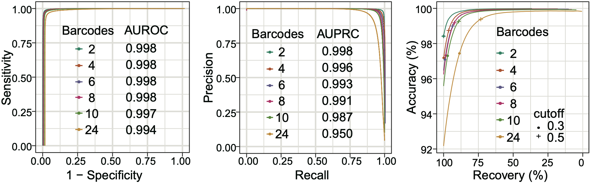
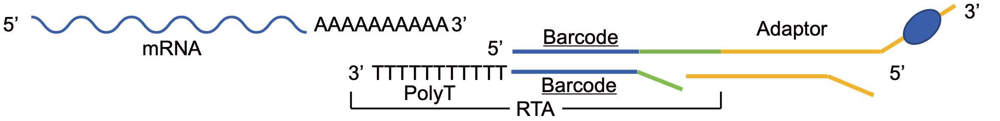

# DecodeR: an R package for barcode demultiplexing of nanopore direct RNA sequencing

Direct RNA sequencing offers a more comprehensive and accurate characterization of RNA biology. However, the main limitations of high-throughput direct RNA sequencing are the RNA amounts and the high cost required for sequencing and the lack of efficient multiplexing methods. Here, we propose a robust and fast multiplexing machine learning pipeline, ·`DecodeR`, offering basic and clinical research of RNA features in a cost-effective manner.

## Contents

- [About DecodeR](#AboutDecodeR)
- [Requirements](#Requirements)
- [Installation](#Installation)
- [Demo](#demo)
- [Models](#Models)
- [Citing DecodeR](#CitingDecodeR)
- [License](#LICENSE)
- [Additional information](#Additionalinformation)


## <span id="AboutDecodeR">About DecodeR</span>

The raw current signals were extracted from fast5 files using R package [rhdf5](https://github.com/grimbough/rhdf5). We implemented the [smoother](https://CRAN.R-project.org/package=smoother) method for the raw current signals to reduce the noise. We extracted signals of the adapter and the barcode from the raw electrical signals according to the characteristic higher and more stable current change generated by poly(A) tails and the lower current signals of DNA molecules. Then the cpt.meanvar function in the R package [changepoint](https://CRAN.R-project.org/package=changepoint) was used to divide the current signals of each barcode into 100 segments and calculated the average current values of each segment as a feature vector for modeling. A matrix of 100 columns generated from all barcodes was eventually used for model training. The R package [caret](https://CRAN.R-project.org/package=caret) was implemented to streamline the process to produce the predictive models based on the Random Forest classifier.


We tested `DecodeR` for different number of barcodes (from 2 to 24), we found that all of the global accuracy of demultiplexing was maintained above 92.2%, with AUROC higher than 0.99 and AUPRC higher than 0.95. By modulating the prediction probability of classifier, users can determine the most suitable trade-off between classification accuracy and reads recovery for different research goals. For example, when the cutoff of predicted probabilities increases to 0.5, the accuracy of demultiplexing increases to 99.4% for 24 barcodes.




## <span id="Requirements">Requirements</span>

#### Hardware Requirements

The `DecodeR` package requires only a standard computer with enough RAM to support the operations defined by a user. For minimal performance, this will be a computer with about 2 GB of RAM. For optimal performance, we recommend a computer with the following specs:

RAM: 16+ GB

CPU: 4+ cores, 2.3+ GHz/core

The runtimes below are generated using a computer with 16 GB RAM, 8 cores@2.3 GHz and internet of speed 25 Mbps.

#### Software Requirements

##### OS requirements

The package development version is tested on *Linux* and *Mac OSX* operating systems. The developmental version of the package has been tested on the following systems:

Linux: Ubuntu 16.04

Mac OSX:

##### Installing R version 3.6.0 on Ubuntu 16.04

Before setting up the `DecodeR` package, users should have `R` version 3.6.0 or higher, and several packages set up from CRAN.

the latest version of R can be installed by adding the latest repository to `apt`:

```shell
sudo echo "deb http://cran.rstudio.com/bin/linux/ubuntu xenial/" | sudo tee -a /etc/apt/sources.list
gpg --keyserver keyserver.ubuntu.com --recv-key E084DAB9
gpg -a --export E084DAB9 | sudo apt-key add -
sudo apt-get update
sudo apt-get install r-base r-base-dev
```

##### Installing other dependent R packages

If you want to use DecodeR, you'd better install the following R packages firstly.

- [changepoint_2.2.2](https://CRAN.R-project.org/package=changepoint)
- [data.table_1.14.0](https://cran.r-project.org/web/packages/data.table/)
- [randomForest_4.6-14](https://cran.r-project.org/web/packages/randomForest/index.html)
- [rhdf5_2.36.0](https://www.bioconductor.org/packages/release/bioc/html/rhdf5.html)
- [smoother_1.1](https://rdrr.io/cran/smoother/man/smoother.html)
- [caret_6.0-90](https://CRAN.R-project.org/package=caret)


## <span id="Requirements">Installation</span>

Users should install the previously mentioned packages prior to installing `DecodeR`, from an `R` terminal:

```R
# Install packages from CRAN
install.packages(c('changepoint', 'data.table', 'randomForest', 'smoother', 'caret'))

# Install package from Bioconductor Package Maintainer
BiocManager::install("rhdf5")
```

Then, users can install the released version of DecodeR from GitHub with:

```R
if (!require(remotes)) install.packaages("remotes")
remotes::install_github("ChaoTang-SCU/DecodeR")
```

Or, download the compressed .zip source file from this repository and install  `DecodeR` by command line:

```shell
R CMD INSTALL DecodeR_0.1.0.tar.gz
```

which should install in about 1 minute.


## <span id="Demo">Demo</span>

#### 1. Basecalling of FAST5 file

In case the FAST5 files are not basecalled yet, we encourage the users use ONT recommended Guppy Basecalling software to convert the FAST5 to fastq file.

```shell
guppy_basecaller -v
# : Guppy Basecalling Software, (C) Oxford Nanopore Technologies, Limited. Version 4.2.3+8aca2af8
guppy_basecaller -i /path/to/fast5 \
                 -s /path/to/fastq/output \
                 --u_substitution off \
                 --device "cuda:0" \
                 -c rna_r9.4.1_70bps_hac.cfg
```

#### 2. Split fastq file by barcode

##### Barcode prediction

```R
library(DecodeR)

# get example file from package
fast5file <- system.file("extdata/demo2_0.fast5", package = "DecodeR")

# load in the model, limited by file size only the 2 barcodes model were built into the package
data("Model_2barcodes")

# predict the barcode of example fast5 file
pred <- DecodeR(fast5 = fast5file, model = Model_2barcodes) # about 10 seconds
```

##### Output formats

```R
head(pred)
#                                         Read Barcode Probability
# 1: read_0b3cabf5-44b4-4438-86df-4dfa672000e1  RTA-33       1.000
# 2: read_0d11e3c0-00ca-4531-a7fc-55fc75d3bb1f  RTA-33       1.000
# 3: read_10cefe5e-6441-4c80-ba98-dbd50c4d6cf3  RTA-33       1.000
# 4: read_12b81f83-f74f-4c45-b6b5-7e7168546ddb  RTA-33       1.000
# 5: read_160d5209-db4c-463c-9e1c-813e0d8e8737  RTA-35       0.994
# 6: read_180def1e-e4cb-4f8b-85de-100e7fd584f9  RTA-33       0.958
# histogram of predicted probability
hist(pred$Probability, xlab = "Probability", main = "Histogram of Probability")

# number of each barcode
table(pred$Barcode)
# RTA-33 RTA-35
#     39     19
```

##### Set custom cutoff for unclassified read

Here, we asigned the read which prediction probability lesss than 0.8 as unclassified read.

```R
# set cutoff for unclassified read
pred2 <- DecodeR(fast5 = fast5file, model = Model_2barcodes, cutoff = 0.8)
table(pred2$Barcode)
#      RTA-33       RTA-35 unclassified
#          37           19            2
```

##### Split fastq file 

```R
BiocManager::install("ShortRead") # The Bioconductor Package ShortRead was dependent for spliting fastq file
library(ShortRead)
fq <- ShortRead::readFastq("/path/to/fastq/file/*.fastq")
R2B <- with(pred2, split(Read, Barcode))

for(i in seq_along(R2B)) {
  fqi <- fq[mapply(function(x) x[1], strsplit(as.character(ShortRead::id(fq)), " ")) %in% gsub("read_", "", R2B[[i]])]
  ShortRead::writeFastq(object = fqi, file = paste0("/path/to/split/fastq/file", names(R2B)[i], ".fastq"))
}
```

| File name                  | File size | Description                                            |
| -------------------------- | --------- | ------------------------------------------------------ |
| `fastq/RTA-33.fastq`       | 22 KB     | Sequences that were classified as `RTA-33` barcode.    |
| `fastq/RTA-35.fastq`       | 9 KB      | Sequences that were classified as `RTA-35` barcode.    |
| `fastq/unclassified.fastq` | 1 KB      | Sequences that could not be classified as any barcode. |

The version information about **R**, the OS and attached or loaded packages for this `Demo` analysis:

```R
sessionInfo()
# R version 4.1.0 (2021-05-18)
# Platform: x86_64-apple-darwin17.0 (64-bit)
# Running under: macOS Big Sur 10.16
# 
# Matrix products: default
# BLAS:   /Library/Frameworks/R.framework/Versions/4.1/Resources/lib/libRblas.dylib
# LAPACK: /Library/Frameworks/R.framework/Versions/4.1/Resources/lib/libRlapack.dylib
# 
# locale:
# [1] zh_CN.UTF-8/zh_CN.UTF-8/zh_CN.UTF-8/C/zh_CN.UTF-8/zh_CN.UTF-8
# 
# attached base packages:
# [1] stats     graphics  grDevices utils     datasets  methods   base
# 
# other attached packages:
# [1] DecodeR_0.1.0
# 
# loaded via a namespace (and not attached):
# [1] zoo_1.8-9          compiler_4.1.0     parallel_4.1.0     rhdf5_2.36.0
# [5] xts_0.12.1         curl_4.3.2         rhdf5filters_1.4.0 grid_4.1.0
# [9] data.table_1.14.0  changepoint_2.2.2  TTR_0.24.2         smoother_1.1
# [13] lattice_0.20-44    Rhdf5lib_1.14.2   ShortRead_1.50.0
```


## <span id="Models">Models</span>

Other pre-trainded models for 4, 6, 8, 10, 12, 18 and 24 barcodes can be downloaded from [here]( https://doi.org/10.6084/m9.figshare.22678729).


## <span id="CitingDecodeR">Citing DecodeR</span>

A pre-print is going to be uploaded soon.


## <span id="License">License</span>

GNU General Public License v3.0


## <span id="Additionalinformation">Additional information</span>

#### How to build barcoded direct RNA sequencing libraries:

To build the barcoded libraries, please use the following oligonucleotide DNA sequences in place of the sequences provided with the Direct RNA Sequencing Kit (RTA). The barcode is embedded in the oligoA sequence, which will be ligated to the RNA molecule during the library preparation. The oligoA sequence contains the barcode that will be attached to the RNA molecule during library preparation. The oligoB sequence contains a barcode and poly(T), which can be used to capture poly(A)-tailed RNA. Each oligoA corresponds to an oligoB. Each oligoA matches an oligoB. The structure is shown in the figure below:



| RTA ID | Barcode sequence             | OligoA (Top sequence)                                     | OligoB (Bottom sequence)                                     |
| ------ | ---------------------------- | --------------------------------------------------------- | ------------------------------------------------------------ |
| RTA-03 | CCTGGTAACTGGGACACAAGACTC     | 5'-/Phos/<u>**CCTGGTAACTGGGACACAAGACTC**</u>TAGTAGGTTC-3' | 5'-GAGGCGAGCGGTCAATTTT<u>GAGTCTTGTGTCCCAGTTACCAGG</u>TTTTTTTTTT-3' |
| RTA-06 | CCTCGTCGGTTCTAGGCATCGCGTATGC | 5'-/Phos/<u>CCTCGTCGGTTCTAGGCATCGCGTATGC</u>TAGTAGGTTC-3' | 5'-GAGGCGAGCGGTCAATTTT<u>GCATACGCGATGCCTAGAACCGACGAGG</u>TTTTTTTTTT-3' |
| RTA-08 | ACGTAACTTGGTTTGTTCCCTGAA     | 5'-/Phos/<u>ACGTAACTTGGTTTGTTCCCTGAA</u>TAGTAGGTTC-3'     | 5'-GAGGCGAGCGGTCAATTTT<u>TTCAGGGAACAAACCAAGTTACGT</u>TTTTTTTTTT-3' |
| RTA-09 | CCTCCTTCAGAAGAGGGTCGCTTCTACC | 5'-/Phos/<u>CCTCCTTCAGAAGAGGGTCGCTTCTACC</u>TAGTAGGTTC-3' | 5'-GAGGCGAGCGGTCAATTTT<u>GGTAGAAGCGACCCTCTTCTGAAGGAGG</u>TTTTTTTTTT-3' |
| RTA-10 | GAGAGGACAAAGGTTTCAACGCTT     | 5'-/Phos/<u>GAGAGGACAAAGGTTTCAACGCTT</u>TAGTAGGTTC-3'     | 5'-GAGGCGAGCGGTCAATTTT<u>AAGCGTTGAAACCTTTGTCCTCTC</u>TTTTTTTTTT-3' |
| RTA-12 | CACACACCGACAACTTTCTT         | 5'-/Phos/<u>CACACACCGACAACTTTCTT</u>TAGTAGGTTC-3'         | 5'-GAGGCGAGCGGTCAATTTT<u>AAGAAAGTTGTCGGTGTGTG</u>TTTTTTTTTT-3' |
| RTA-15 | AACCCTCGCTGTGCCTAGTT         | 5'-/Phos/<u>AACCCTCGCTGTGCCTAGTT</u>TAGTAGGTTC-3'         | 5'-GAGGCGAGCGGTCAATTTT<u>AACTAGGCACAGCGAGGGTT</u>TTTTTTTTTT-3' |
| RTA-16 | CGAGGAGGTTCACTGGGTAG         | 5'-/Phos/<u>CGAGGAGGTTCACTGGGTAG</u>TAGTAGGTTC-3'         | 5'-GAGGCGAGCGGTCAATTTT<u>CTACCCAGTGAACCTCCTCG</u>TTTTTTTTTT-3' |
| RTA-17 | CTAACCCATCATGCAGAAGC         | 5'-/Phos/<u>CTAACCCATCATGCAGAAGC</u>TAGTAGGTTC-3'         | 5'-GAGGCGAGCGGTCAATTTT<u>GCTTCTGCATGATGGGTTAG</u>TTTTTTTTTT-3' |
| RTA-19 | TTCGGATTCTATTCCTCGTGTCTA     | 5'-/Phos/<u>TTCGGATTCTATTCCTCGTGTCTA</u>TAGTAGGTTC-3'     | 5'-GAGGCGAGCGGTCAATTTT<u>TAGACACGAGGAATAGAATCCGAA</u>TTTTTTTTTT-3' |
| RTA-21 | AAGCGTCTTTGTCTGAAACCTCTC     | 5'-/Phos/<u>AAGCGTCTTTGTCTGAAACCTCTC</u>TAGTAGGTTC-3'     | 5'-GAGGCGAGCGGTCAATTTT<u>GAGAGGTTTCAGACAAAGACGCTT</u>TTTTTTTTTT-3' |
| RTA-22 | AGAACCATACTCCGACTTGTGTGA     | 5'-/Phos/<u>AGAACCATACTCCGACTTGTGTGA</u>TAGTAGGTTC-3'     | 5'-GAGGCGAGCGGTCAATTTT<u>TCACACAAGTCGGAGTATGGTTCT</u>TTTTTTTTTT-3' |
| RTA-24 | ACCCTCCAGAAGTACCTCTGAT       | 5'-/Phos/<u>ACCCTCCAGAAGTACCTCTGAT</u>TAGTAGGTTC-3'       | 5'-GAGGCGAGCGGTCAATTTT<u>ATCAGAGGTACTTCTGGAGGGT</u>TTTTTTTTTT-3' |
| RTA-26 | CATACCGACTACGCATTCTCAT       | 5'-/Phos/<u>CATACCGACTACGCATTCTCAT</u>TAGTAGGTTC-3'       | 5'-GAGGCGAGCGGTCAATTTT<u>ATGAGAATGCGTAGTCGGTATG</u>TTTTTTTTTT-3' |
| RTA-27 | TCAGTGAGGATCTACTTCGCCA       | 5'-/Phos/<u>TCAGTGAGGATCTACTTCGCCA</u>TAGTAGGTTC-3'       | 5'-GAGGCGAGCGGTCAATTTT<u>TGGCGAAGTAGATCCTCACTGA</u>TTTTTTTTTT-3' |
| RTA-28 | CTATACGAAGCTGAGGGACTGC       | 5'-/Phos/<u>CTATACGAAGCTGAGGGACTGC</u>TAGTAGGTTC-3'       | 5'-GAGGCGAGCGGTCAATTTT<u>GCAGTCCCTCAGCTTCGTATAG</u>TTTTTTTTTT-3' |
| RTA-29 | TAGTGGATGACCAAGGATAGCC       | 5'-/Phos/<u>TAGTGGATGACCAAGGATAGCC</u>TAGTAGGTTC-3'       | 5'-GAGGCGAGCGGTCAATTTT<u>GGCTATCCTTGGTCATCCACTA</u>TTTTTTTTTT-3' |
| RTA-32 | GATCACAGAGATGCCTTCAGTG       | 5'-/Phos/<u>GATCACAGAGATGCCTTCAGTG</u>TAGTAGGTTC-3'       | 5'-GAGGCGAGCGGTCAATTTT<u>CACTGAAGGCATCTCTGTGATC</u>TTTTTTTTTT-3' |
| RTA-33 | CATACCTGGAACGTGGTACACCTGTA   | 5'-/Phos/<u>CATACCTGGAACGTGGTACACCTGTA</u>TAGTAGGTTC-3'   | 5'-GAGGCGAGCGGTCAATTTT<u>TACAGGTGTACCACGTTCCAGGTATG</u>TTTTTTTTTT-3' |
| RTA-35 | TGGAAGATGAGACATCCTGATCTACG   | 5'-/Phos/<u>TGGAAGATGAGACATCCTGATCTACG</u>TAGTAGGTTC-3'   | 5'-GAGGCGAGCGGTCAATTTT<u>CGTAGATCAGGATGTCTCATCTTCCA</u>TTTTTTTTTT-3' |
| RTA-36 | TCACTACTCACGACAGGTGGCATGAA   | 5'-/Phos/<u>TCACTACTCACGACAGGTGGCATGAA</u>TAGTAGGTTC-3'   | 5'-GAGGCGAGCGGTCAATTTT<u>TTCATGCCACCTGTCGTGAGTAGTGA</u>TTTTTTTTTT-3' |
| RTA-37 | GCTAGGTCAATCGATCCTTCGGAAGT   | 5'-/Phos/<u>GCTAGGTCAATCGATCCTTCGGAAGT</u>TAGTAGGTTC-3'   | 5'-GAGGCGAGCGGTCAATTTT<u>ACTTCCGAAGGATCGATTGACCTAGC</u>TTTTTTTTTT-3' |
| RTA-40 | CACCCACACTTACGCTTCAGGACGTA   | 5'-/Phos/<u>CACCCACACTTACGCTTCAGGACGTA</u>TAGTAGGTTC-3'   | 5'-GAGGCGAGCGGTCAATTTT<u>TACGTCCTGAAGCGTAAGTGTGGGTG</u>TTTTTTTTTT-3' |
| RTA-42 | ATGCTTGTTACATCACAGAACCCTGGAC | 5'-/Phos/<u>ATGCTTGTTACATCACAGAACCCTGGAC</u>TAGTAGGTTC-3' | 5'-GAGGCGAGCGGTCAATTTT<u>GTCCAGGGTTCTGTGATGTAACAAGCAT</u>TTTTTTTTTT-3' |
